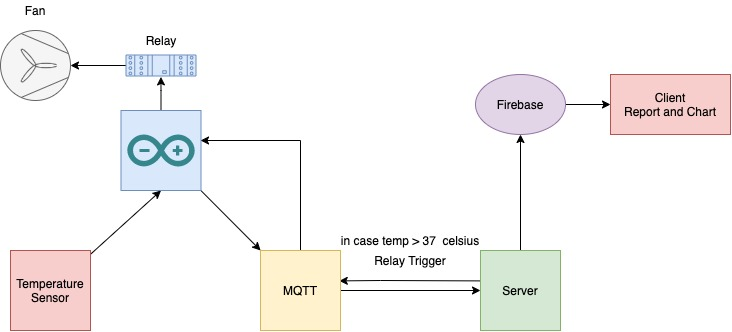
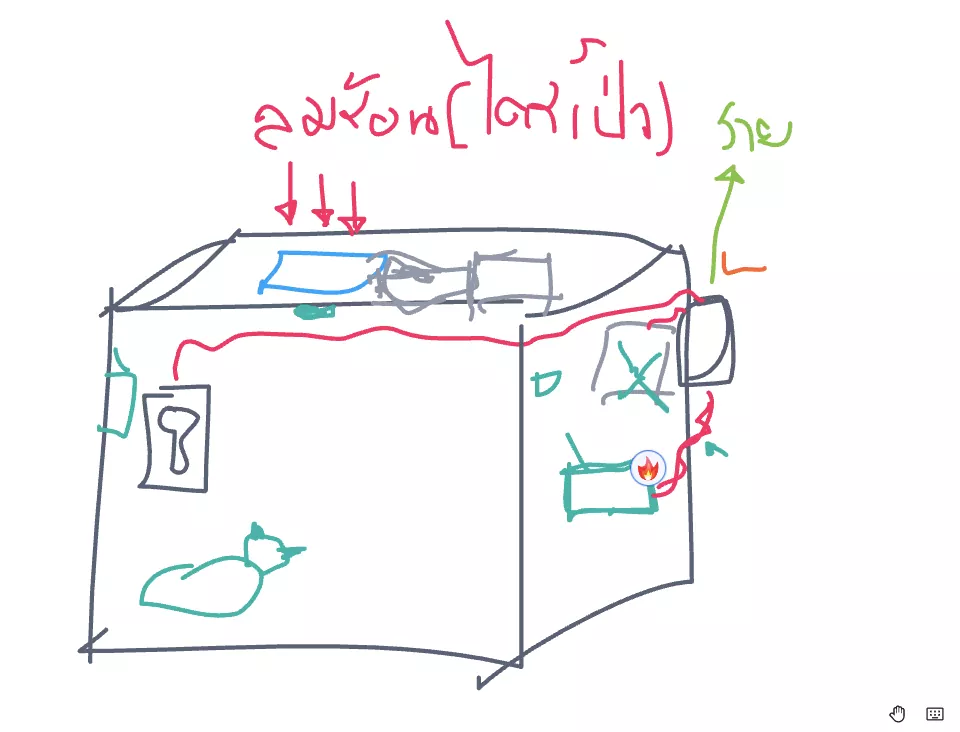

# IOT - KMUTNB ( Mini Project )

## .env file

```
MQTT_HOST=`your mqtt host`
MQTT_USERNAME=`your mqtt username`
MQTT_PASS=`your mqtt password`
```

## File Structure

```
- .env
- .Prettierrc
- app.js ( main file for create function )
- config.js ( config and connect mqtt server )
- package.json
- yarn.lock ( lock version of dependencies )
- .vscode ( config visual studio code )
    - setting.json
```

## IOT and Software Architecture



## Box ( Sketch Model )


